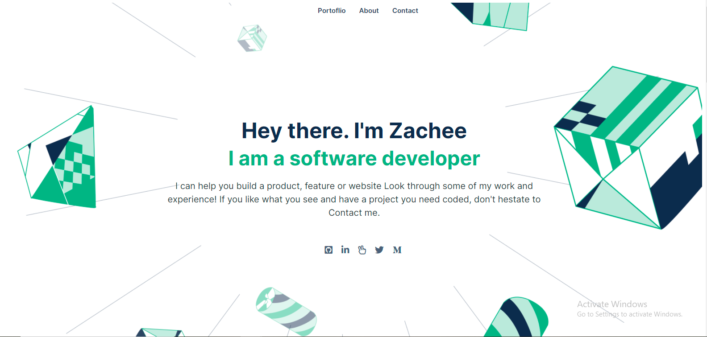
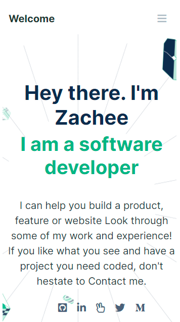

# My projects and about section 

> This is my portfolio website and it is both mobile and Desktop responsive. 
> It contain my describtion, projects, skills and framework and my contacts.

Desktop view                                      |  Mobile Header view
:------------------------------------------------:|:-----------------------------------------------:
                     |  

## Built With

- HTML 
- CSS
- JS 

## Project link

[Site Link](https://ishimwezachee.github.io/Portfolio/)

## Getting Started
To get a local copy, just follow the steps That I am going to mention bellow:

### Prerequisites

### Setup
To get this project in your local machine, follow these steps:
- Open terminal 
- clone the repository :https://github.com/ishimwezachee/Portfolio.git
- Cd in the project folder
- run the project in your browser

### install
 - run npm install to install the required linters

 ### tests
 - run the project in the browsers 
 - use google tool to inspect and check in mobile version.

## Authors

👤 **Author1**

- GitHub: [@zacheeIshimwe](https://github.com/ishimwezachee)
- LinkedIn: [@zacheeIshimwe](https://www.linkedin.com/in/zachee-ishimwe-ab952a119/)

## 🤝 Contributing

Contributions, issues, and feature requests are welcome!

Feel free to check the [issues page](../../issues/).

## Show your support

Give a ⭐️ if you like this project!

## 📝 License

This project is [MIT](./MIT.md) licensed.